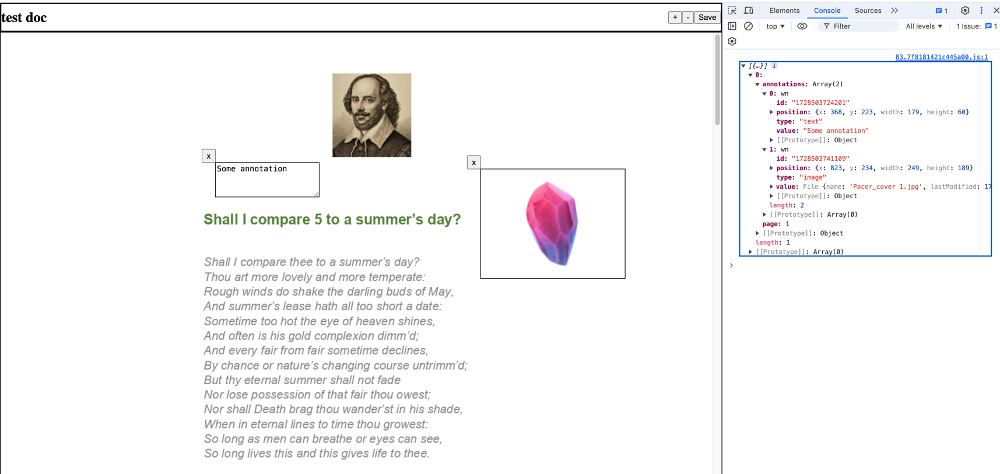

# DocumentsViewer
## Скриншоты реализации

## Ссылка на приложение
[Ссылка на github-pages](https://aleksey-kornienko-xsolla.github.io/documents-viewer/viewer/1)

## Описание решения
- Для отображения документа используется виртуальный скролл на основе модуля из cdk (@angular/cdk/scrolling), что при большом
количестве страниц будет несильно нагружать приложение.

- Во время реализации скролла было проблема с recycling со стороны angular, она была решена с помощь функции trackBy.

- Был настроен автоматический деплой на github-pages с помощью github-actions.
